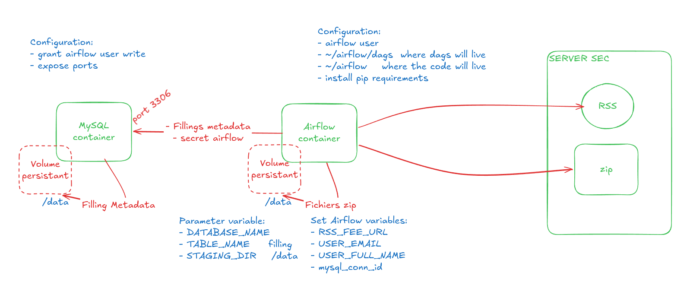

# Financial Statement ETL

A proof-of-concept ETL pipeline that ingests SEC filings disclosures into a
medallion-style data architecture using Apache Airflow.

The pipeline runs  a batch process on a 10-minute schedule, discovers new filings via the SEC
RSS feed, downloads the associated ZIP archives, and persists filing
metadata into MySQL for downstream analysis.

---

## Architecture

The project follows a **hexagonal (ports & adapters)** architecture with a
**medallion** data layout.

### Medallion layers

| Layer      | Storage                  | Content                              |
|------------|--------------------------|--------------------------------------|
| **Bronze** | `$DATA_FOLDER/*.zip`     | Raw archives downloaded from SEC |
| **Silver** | MySQL `filling` table    | Parsed filing metadata               |
| **Gold**   | *(planned)*              | Aggregated / analytical views        |

### Runtime topology



---

## Prerequisites

- Docker ≥ 24
- Docker Compose ≥ 2.20
- An SEC-compliant `User-Agent` (SEC requires a real name + email)

---

## Quick start

```bash
# 1. Clone
git clone <your-repo-url> fs-etl
cd fs-etl

# 2. Create your environment files
cp .env.example .env.docker
$EDITOR .env.docker      # fill in passwords, user agent, RSS URL

# 3. Generate a Fernet key (required by Airflow)
python -c "from cryptography.fernet import Fernet; print(Fernet.generate_key().decode())"
# paste the output into AIRFLOW__CORE__FERNET_KEY in .env.docker

# 4. Prepare persistent folders with the right ownership
#    (the Airflow container runs as UID 50000)
sudo mkdir -p /path/to/data /path/to/mysql-data
sudo chown -R 50000:0 /path/to/data
sudo chown -R 50000:0 /path/to/mysql-data

# 5. Build and start
docker compose --env-file .env.docker up --build
```
## Configuration

All configuration is provided via environment variables, split across two files:

### `.env.docker` — runtime configuration

| Variable                        | Purpose                                        |
|---------------------------------|------------------------------------------------|
| `MYSQL_ROOT_PASSWORD`           | MySQL root password (init only)                |
| `MYSQL_USER` / `MYSQL_PASSWORD` | Application user for the ETL DB                |
| `MYSQL_DATABASE`                | Airflow metadata DB name                       |
| `AIRFLOW__CORE__FERNET_KEY`     | Encrypts connections/variables at rest         |
| `AIRFLOW__WEBSERVER__SECRET_KEY`| Flask session key                              |
| `DATA_FOLDER`                   | Host path for raw ZIP archives (bronze layer)  |
| `DB_FOLDER`                     | Host path for the MySQL data volume            |
| `AIRFLOW_CONN_MY_LOCAL_MYSQL`   | Connection URI to the ETL database             |
| `AIRFLOW_VAR_RSS_FEED_URL`      | SEC RSS feed URL to poll                       |
| `AIRFLOW_VAR_USER_EMAIL`        | Contact email (sent in the SEC User-Agent)     |
| `AIRFLOW_VAR_USER_FULL_NAME`    | Full name (sent in the SEC User-Agent)         |

### Airflow Variables (set at startup)

The DAG reads runtime parameters from Airflow Variables. These are injected
from `AIRFLOW_VAR_*` environment variables at container start:

- `RSS_FEED_URL` — SEC Atom feed
- `USER_EMAIL` — required by SEC for the `User-Agent` header
- `USER_FULL_NAME` — required by SEC for the `User-Agent` header
- `STAGING_DIR` — inside-container path where ZIPs are written (`/data`)
- `TABLE_NAME` — target table for filing metadata (`filling`)
- `mysql_conn_id` — Airflow connection ID (`my_local_mysql`)

> **SEC policy reminder.** The SEC requires a descriptive `User-Agent` header
> on every request. Set a real name and email — generic user agents are
> rate-limited or blocked.
